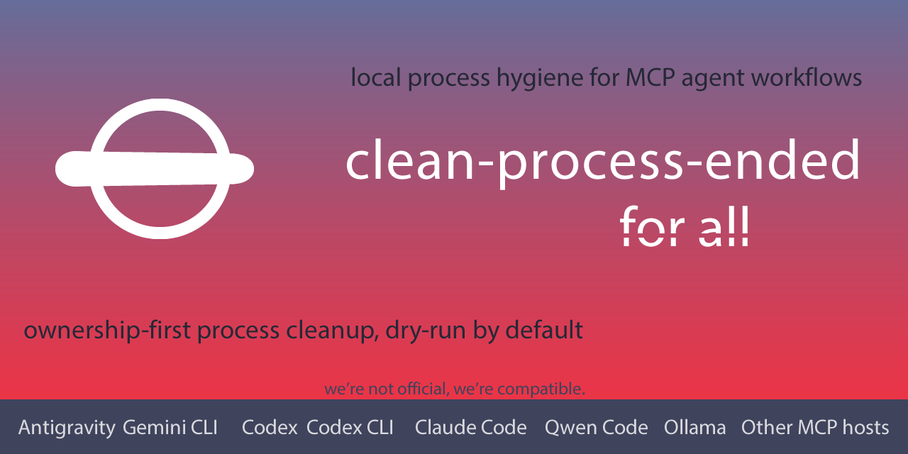

# clean-process-ended

<p align="center">
  
</p>

其他语言：[English](./README.md) | [Español](./README_ES.md) | [Deutsch](./README_DE.md) | [Português do Brasil](./README_PT_BR.md) | [日本語](./README_JA.md)

**面向 AI coding agent 的 ownership-first 本地 MCP process janitor；适用于 Codex Desktop、Claude Code、Gemini CLI、使用 Ollama-backed Qwen models 的 Qwen Code CLI 非破坏性 tool 工作流，以及 MCP-compatible host 工作流，尤其是子进程可能比实际任务更长寿的场景。**

`clean-process-ended` 检查与 agent 和 MCP session 相关的本地子进程，把 session ownership 与弱相似度信号分开，并在考虑任何环境操作之前生成可审查、由 reproducible evidence 支撑的 dry-run cleanup plan。

`clean-process-ended` 作为本地 stdio MCP server 运行。Codex Desktop、Claude Code 和 Gemini CLI 具备 dry-run 验证；使用 Ollama-backed Qwen models 的 Qwen Code CLI 具备 native 非破坏性 MCP tool invocation 验证。其他 MCP-compatible hosts 可以通过 generic MCP profile 测试。

它面向本地 MCP 和 coding-agent 工作流，在这些工作流中，子进程、browser helper、devtools、本地服务器或 MCP server 可能在 host session 或任务结束后继续运行。本项目按 ownership evidence 分类进程，而不是按进程名相似度分类，然后报告哪些是可操作的、被阻止的、相关的或未知的。

它不会把进程证据发送到远程服务，默认不保存完整 command line，也不会把 beta 诊断结果当作终止进程的许可。

## 你得到的能力

- **Agent process visibility**：查看与 Codex Desktop、Claude Code、Gemini CLI、使用 Ollama-backed Qwen models 的 Qwen Code CLI 非破坏性 tool 工作流、generic MCP host 以及未来已验证 runtime 相关的本地子进程，而不是按进程名清理。
- **Ownership-first safety**：在规划任何破坏性操作之前，先分类 `owned_current_session`、`related_unowned` 和 `unknown_owner`。
- **Dry-run close checks**：通过 `janitor_discovery`、`session_close_check`、report、candidate 和 audit bundle 给 agent 一个明确的任务结束协议。
- **Reproducible evidence**：生成 sanitized receipt、SHA-256 evidence、audit bundle 和 support-matrix notes 供审查。
- **Managed lifecycle helpers**：用 `cpe-run` 包装已知本地命令，让之后的 dry-run reconciliation 拥有更强证据。
- **可选 memory pairing**：与 `codex-agent-mem` ([GitHub](https://github.com/MarceloCaporale/codex-agent-mem)) 组合，让 continuity 和 process hygiene 在同一个关闭流程中完成。

## 为什么这个 repository 存在

- AI coding agent 可能留下 MCP server、browser driver、本地 dev server 和 helper process。
- `node`、`python`、`chrome`、`mcp` 或 `codex` 这样的进程名并不能证明 ownership。
- 用户需要安全的任务关闭协议，然后再决定是否应该清理某个进程。
- 公共工具应该让保守路径变得容易：inspect、explain、dry-run、record evidence，然后请求人工决策。
- `clean-process-ended` 把本地 process hygiene 变成可审计 workflow，而不是 task manager 中的猜测。

## 状态

- 版本：`0.7.3` beta。
- Runtime：Node.js `>=18.17`。
- 传输：MCP stdio。
- 默认 cleanup：dry-run。
- 默认自动 cleanup：禁用。
- 持久 watcher：默认不安装。

不要把 beta 结果当作人工审查的替代品。v0.7.3 的公开 CLI/MCP surface 提供经过 runtime validation 的 process hygiene、evidence 和 dry-run planning；它不会通过公开 CLI/MCP surface 执行真实终止。

## Validation Snapshot

当前 v0.7.3 public-beta evidence 区分 runtime validation metrics 与 adoption metrics。它证明 discovery、reports、evidence 和 dry-run planning；不声称真实 cleanup validation：

| Area | Current evidence |
| --- | --- |
| MCP tool surface | Server 暴露 close-check、report、explain、policy、audit 和 managed-lifecycle tools。 |
| Codex | 重启后的本地 native validation；仅 dry-run。 |
| Claude Code | 本地 native MCP validation 已完成；仅 dry-run；提供已清理的 evidence summary。 |
| Gemini CLI | 本地 native MCP validation 已完成；仅 dry-run；提供已清理的 evidence summary。 |
| Qwen Code CLI | 使用 Ollama-backed Qwen models 的本地 native MCP tool invocation validation 已完成；仅限非破坏性 diagnostic workflow；不声称完整 dry-run close-check parity。 |
| Public cleanup real | public validation 中真实 cleanup 执行为 `0`。 |
| Evidence privacy | Public receipts 设计为排除完整 command lines、raw process output、env vars、tokens 和 secrets。 |

## 公开验证指标

这些是 public beta line 和 release gate 的真实 validation metrics，不是 stars、forks、downloads 或第三方生产使用这类 adoption metrics：

- 已验证 MCP host workflows：`4`（`codex`、`claude_code`、`gemini_cli`、`qwen_code`），包括三个 dry-run close-check workflows 和一个 Qwen Code CLI native non-destructive MCP tool invocation workflow；不声称 Qwen dry-run close-check parity。
- MCP stdio smoke surface：发布的 server 暴露 close-check、report、explain、policy、audit 和 managed-lifecycle tool catalog。
- 本地 release gate：ESLint、syntax checks、Node tests、MCP stdio smoke、strict package validation、public-tree check、dependency audit、`npm pack --dry-run` 和 installed-tarball smoke。
- GitHub Actions matrix：配置为 Windows、macOS、Linux，覆盖 Node 18、20、22。
- 公开真实 cleanup 执行次数：`0`。
- 生产 dependency audit 目标：`0` moderate-or-higher vulnerabilities。
- Evidence privacy 目标：public receipts 中没有完整 command lines、raw process output、env vars、tokens、secrets 或 live confirm tokens。

## 安装

使用 `npx`：

```bash
npx -y --package clean-process-ended clean-process-ended-mcp
```

或安装包并运行二进制命令：

```bash
npm install -g clean-process-ended
cpe-scan report --json
clean-process-ended-mcp
```

## MCP Host Snippet

Codex 风格 TOML 配置：

```toml
[mcp_servers.clean_process_ended]
command = "npx"
args = ["-y", "--package", "clean-process-ended", "clean-process-ended-mcp"]
env = { CPE_HOST_PROFILE = "codex" }
```

当前包暴露的 host profile：

- `codex`
- `claude_code`
- `gemini_cli`
- `qwen_code`
- `generic_mcp_host`

更多 samples 在 `samples/`，可复制改造的 examples 在 `examples/`。

## 支持矩阵

该矩阵描述 v0.7.3 的公开 profile 意图和验证状态。它不声称 cleanup 安全性超出已记录的 policy gates。请查看 `docs/support-matrix.md` 和 `docs/validation/` 获取 evidence levels 与发布状态。

| Host | Profile | 公开状态 |
| --- | --- | --- |
| Codex | `codex` | 当前本地验证已在重启后完成；仅 dry-run。 |
| Claude Code | `claude_code` | 当前本地 native validation 已完成；仅 dry-run。 |
| Gemini CLI | `gemini_cli` | 当前本地 native validation 已完成；仅 dry-run。 |
| Qwen Code CLI | `qwen_code` | 使用 Ollama-backed Qwen models 的当前本地 native MCP tool invocation validation 已完成；仅限非破坏性 diagnostic workflow。 |
| Generic MCP Host | `generic_mcp_host` | 仅 diagnostic profile；host-specific ownership claims 需要单独 evidence。 |

## CLI

常用非破坏性命令：

```bash
cpe-scan report --json
cpe-scan candidates --json
cpe-scan cleanup --dry-run --scope owned_current_session --json
cpe-scan janitor-discovery --client codex --json
cpe-scan agent-protocol --client codex --json
cpe-scan session-close-check --project-key my-project --json
cpe-scan audit-bundle --output-dir ./evidence/cpe --json
cpe-scan smoke-stdio --json
```

Managed lifecycle evidence：

```bash
cpe-run --host codex --role mcp-server -- node ./server.js
cpe-scan managed-reconcile --json
cpe-scan managed-lifecycle --json
cpe-scan managed-cleanup-dryrun --json
```

`managed-cleanup-dryrun` 在 v0.7.3 中仅用于报告。

## Agent Close Protocol

安装 MCP 只会让 host 可以看到这些 tools。它不保证 agent 会调用它们。

推荐的 agent 行为：

- 使用 `janitor_discovery` 学习非破坏性协议；
- 在涉及子进程、MCP servers、browsers/devtools、subagents、local servers 或 background jobs 的非平凡任务结束时运行 `session_close_check`；
- 永远不要自主调用 `dry_run=false` 或 `--no-dry-run`；
- 在询问人类是否进行 real cleanup 之前，总结任何 dry-run plan。

## 与 codex-agent-mem 的可选集成

`codex-agent-mem` v1.0.1 与 `clean-process-ended` v0.7.3 可以分别独立使用，但它们被设计为互补。`codex-agent-mem` 保存 task continuity 和 closure state；`clean-process-ended` 记录 process-hygiene evidence 与 dry-run janitor receipts。两者一起使用时，推荐的关闭流程是：

1. 使用 `codex-agent-mem` 恢复并关闭 continuity；
2. 将 `clean-process-ended` 作为 dry-run close check 运行；
3. 只在 memory 中保存紧凑的 `process_janitor_receipt` summary 或 hash。

组合 workflow 可以减少重复上下文，并在任务结束时加入更安全的 hygiene check，从而改善用户体验。这是可选集成：两个 MCP 都不是对方的硬依赖。公开 receipt schemas 和 examples 位于 `schemas/` 与 `docs/fixtures/codex-agent-mem/`。

## 项目元数据

- Author：Marcelo Caporale。
- X：`https://x.com/MarceloCaporale`。
- Studio：`https://visualaimedia.com`。
- Lab：`https://visualsystemslab.com`。
- License：Apache-2.0。
- Repository：`https://github.com/MarceloCaporale/clean-process-ended`。
- MCP Registry name：`io.github.marcelocaporale/clean-process-ended`。
- 相关可选 MCP：`codex-agent-mem`。

## Cleanup 安全

默认情况下，cleanup 是 dry-run，并且 scope 为 `owned_current_session`。在 v0.7.3 中，公开 CLI/MCP surface 提供经过 runtime validation 的 process hygiene、evidence 和 dry-run planning：real termination 仍不能通过公开 CLI/MCP 操作，因为 evidence inputs 被有意不暴露。内部 real-cleanup gate 比公开 surface 更严格，在任何 termination path 之前都要求以下全部条件：

- 当前 safety policy 中存在合格的 `managed_strong` 或 `managed_strong_expired` candidate；
- 可信安装配置中设置 `cleanup.realExecutionEnabled=true`；
- `--no-dry-run`；
- 来自前一个 dry-run plan 的 fresh confirm token；
- 来自先前 audit/receipt bundle 的有效 SHA-256 evidence；
- 没有 policy blocker，例如 unknown ownership、browser/devtools guardrails 或 host-root protection。

如果未来版本公开暴露 real cleanup，它们必须显式暴露 evidence SHA-256 inputs，并保持这些 gates 完整。

`related_unowned` 和 `unknown_owner` 默认仅用于报告。

实验性 auto-cleanup 只能 opt-in。它默认禁用，必须在可信安装配置中显式确认，即使启用后也应视为实验性功能。

## 文档

- `AGENTS.md`：面向 coding agents 和 maintainers 的 repository guide。
- `docs/quickstart.md`：最快的安全 setup 与 close-check 流程。
- `docs/SAFETY_MODEL.md`：cleanup 和 auto-cleanup 安全模型。
- `docs/ARCHITECTURE.md`：scanner、ownership、managed lifecycle 和 audit bundle 架构。
- `docs/design-decisions.md`：产品和架构决策。
- `docs/HOSTS.md`：host profiles 与验证状态。
- `docs/support-matrix.md`：正式 support matrix 和 evidence levels。
- `docs/INSTALL.md`：安装和 host binding 说明。
- `docs/WHEN_TO_USE.md`：何时运行 close checks。
- `docs/AGENT_PROTOCOL.md`：agent 与 project prompts 的指令。
- `docs/INTEGRATION_CODEX_AGENT_MEM.md`：与 `codex-agent-mem` 的可选 continuity integration。
- `docs/MANAGED_LIFECYCLE.md`：managed process lifecycle commands。
- `docs/AUDIT_BUNDLE.md`：非破坏性 evidence bundle 内容。
- `docs/validation/`：validation levels 和 host evidence notes。
- `docs/verification/`：verification notes 和 release-gate summaries。
- `schemas/`：receipts 和 audit bundle summaries 的公开 JSON schemas。
- `examples/`：可复制改造的 host configuration examples。
- `SECURITY.md`：安全报告和支持政策。
- `SUPPORT.md`：公开 support matrix。
- `CHANGELOG.md`：release notes。
- `RELEASE_NOTES_v0.7.3.md`：v0.7.3 release notes。

## Release checks

维护者在准备 tag、GitHub Release、MCP Registry 提交或 npm 发布时运行：

```bash
npm run public-beta-candidate
```

此 gate 包括 ESLint、syntax checks、tests、MCP stdio smoke validation、strict package validation、moderate-or-higher dependency audit、public-tree validation、`npm pack --dry-run` 以及 installed-tarball smoke validation。

然后完成 `docs/release-checklist.md`，刷新 `docs/verification/v0.7.3/README.md` 中列出的 host evidence，等待 GitHub Actions，从公开 GitHub URL 执行外部静态审计，并且只在明确人工批准后继续。

## 许可证

Apache-2.0。
